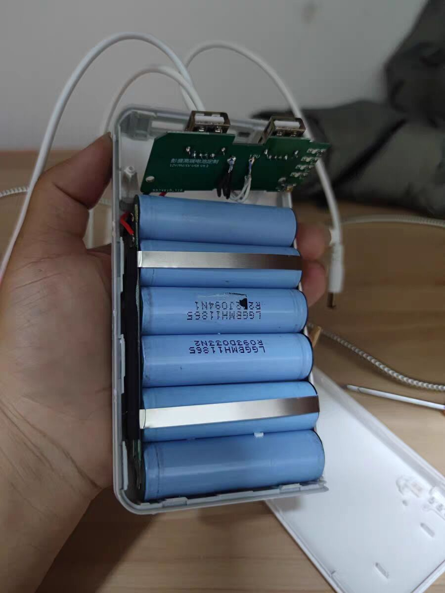
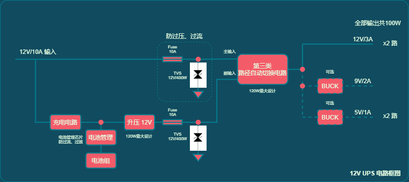

# 12V 大功率/真稳压/真电池管理 UPS 不间断电源

该项目建设中。。。

------

## 特点

1. 准确稳压输出。
2. 电池管理（专用过流/过放芯片） 和 充电管理（专用充电芯片）。
3. 足功率 120W！不搞 廉价/无良 产品。
3. 采用自动路径切换电路 做供电路径切换，非简单使用 两个二极管做供电路径切换。
4. 硬件 SCH 原理图 开源。

## 经历

最近买了一台 小主机（CPU N5095，[关于小主机是什么以及我拿来干什么用（CSDN链接）](https://blog.csdn.net/Staokgo/article/details/122010638)（[知乎链接](https://zhuanlan.zhihu.com/p/425586692)）），一次偶然无意间关掉了其适配器插座电源，导致小主机被强制断电了，还好现代操作系统和硬件还能经得起一两次这种被强制断电，再次上电可以正常开机。

于是想给小主机搞一台 UPS（不间断电源），当插座断电/停电后，UPS 能立刻切换电池供电不至于让小主机强制掉电。我的小主机的适配器是 12V/3A 的，因此找 UPS 输出也得是 至少 12V/3A，淘宝上找来找去发现支持这么 “大” 功率的不多，贵的大五六百、上千咱也没必要买（小主机自己才一千多），找到一家买来试了试，才见其猫腻/糙点太多了。

淘宝上在 100-200 价位之间的。容量基本 20000mAH（也不说是单个锂电池芯的容量简单加和 还是 对于 12V输出来说是这么大，**无良1**）；充电头输出 12.6V，是不是感觉很奇怪，为什么不是 12V？其实是充电头直连电池来做的 3S电池组 充电（3串，4.2V * 3，满电正好就是 12.6V），**无良2**。然后是输出，写的都是什么 9V-12.6V，是不是感觉很奇怪，为什么输出不是稳定不变的 12V？其实是 3S电池组 直连输出，**无良3**。我买的一个，好巧不巧，说是两路 12V/3A 的输出，但是不稳定，测试了好多次，拿各种用电器比如路由器、我的小主机（过程中生怕其供电不稳定把我小主机弄坏了）还有 开发板 等等，来回换着测试，只有一次能两路同时输出，其余都是只能输出一路，**无良4**，很搞我心态的 garbage。

商品页面里一个评论的图，这位拆开了，你看这电路板有多少器件吗，就这？就这卖150了快。

我还问卖家，人家承认 “我们就是这么干的”。

这种东西，要是这个用在 电压敏感的、贵重点的 电子设备，可能一下就给搞坏了。也就日常能看到的 路由器、交换机这些 不那么敏感的，写的 12V 输入，无良 UPS 弄出 12.6V 供电 可能一下搞不坏。 这么不负责任。还有电流能力可能不行，标的 12V/3A，实际到 1A多、2A左右可能（我没实际测）我的设备就直接关停了，越测试越气，因为这东西卖的还不便宜，都接近 二百了，因为 不是一家这样，而是淘宝搜一下，成片成片的好多家都是这样，用的最简单、廉价的电路，点到为止。

我的点在哪里呢，这种东西买的人确实很多，而且我也相信这些东西他们确实能用，也只是能用一下，给路由器、小音响之类的可以，但是达不到给我的小主机当 UPS 的需求，而且还挖掘出这么多 槽点！

一次失望的购物经历。奶奶滴，自己搞个货真价实的！

## 原理框图

12V UPS 电路框图

说明：

1. “第三类-路径自动切换电路” 为 [protection-circuits/掉电保护 简易自动切换电源轨 at master · Staok/protection-circuits (github.com)](https://github.com/Staok/protection-circuits/tree/master/掉电保护 简易自动切换电源轨) 里面的 `双路径自动切换电路仿真-第三类` 电路。

   **格外注意**，第三类里面也有 二极管，过 10A 时候的功率耗散是不允许的，要修改第三类电路，可以主路和副路 都分别用 两个 P-MOS，可以参考 [基于树莓派的超高效UPS（不间断电源） - 电路城 (cirmall.com)](https://www.cirmall.com/circuit/27377/) 里面的那个 MUX 电路。

2. 12V/10A 输入那里，如果后面用不到那么大功率，比如后面最多30W，那么接个 12V/3A 适配器即可；如果输出那里用足 100W，那么输入接个 220V-AC 转 12V/10A-DC 的开关电源模块，金属网格外壳的那种，淘宝很多，相对靠谱。

4. etc.

## TODO List

1. 电池组方案，我在考虑不要用 18650 自组电池组，而是兼顾兼容性，用 3S 航模锂电池 之流的电池。
2. 充电电路选择一个 单芯片方案，要有良好的防止过冲、充满关停。充电有个 5A 充电电流就不错了，此时：输入120W，充电用20W，后边输出大约可以用100W。
3. 电池管理选择一个 单芯片方案，带有过流（120W/3.7V = 32A，有点大，再找找 2S/3S 平衡充电芯片）和过放（即欠压保护）保护。
4. 升压 12V部分，输出要有 10A，选一个芯片方案。
5. 接口：除了5V是 USB Type-A，其它均是 DC005（需要确定一下）。输出接口处 都安排足量的电容做缓冲，小的大的整齐了，小的 0.1uf / 10uf，大的2200uf/25V的。输入接口整 RC消火花。每一个接口的旁边都有一个小 LED 指示有电。
5. 我在考虑 要不加加 一个 Type-C 输入，兼容 快充头。但是对 快充协议 不是很了解，IP系列的芯片有很多，功率也够，但电路结构或许和现有工程有冲突。比如看这个 [IP5389100瓦双向快充移动电源方案 - 立创EDA开源硬件平台 (oshwhub.com)](https://oshwhub.com/wzw666/ip5389)。

1. 原理图再参考参考 之前做过的电源电路，PCB大电流线路开窗加锡，PCB最后按照 硬件规范过一遍。
2. BOM 要廉价，PCB 要小巧。

# 有待参考的项目

- [yanranxiaoxi/Portable-Desktop-Uninterruptible-Power-Supply: 便携桌面不间断电源 (github.com)](https://github.com/yanranxiaoxi/Portable-Desktop-Uninterruptible-Power-Supply)。
- [【ART-Pi】5V不间断电源扩展 - 立创EDA开源硬件平台 (oshwhub.com)](https://oshwhub.com/asxs/kuo-zhan-bandemo)，这个可以看看，是2S的。